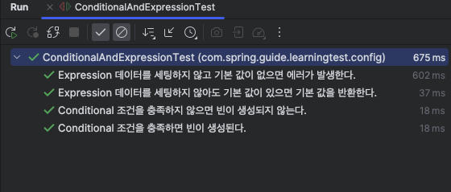

# @Conditional 학습 테스트 만들어보기

업무를 하다보면 조건에 따라 빈의 생명주기를 관리해야 할 때가 있다.

B2B 솔루션이라고 가정하면 애플리케이션이 설치되는 시점에 특정 제품의 구매 여부 같은 옵션을 세팅하는 경우가 이에 해당된다.

이 때, `@Conditional` 애노테이션을 주로 사용되는데 이 글에서는 `@Conidtional` 애노테이션이 어떻게 동작하는지 보다는 `Property`에 설정한 키값에 따라 빈이 등록되는지 + `@Value`에 SpEL이 등록되지 않는 경우 기본 값을 등록하는 것을 학습 테스트로 만들어 보겠다.

예제는 제품을 구매했을 때 프리미엄의 구매 여부를 조건으로 설정하는 간단한 예제를 사용하겠다.

```java
@TestConfiguration
@ConditionalOnProperty(value = "product.premium.purchase", havingValue = "true")
@Getter
public static class ConditionalConfig {

    @Value("${product.premium.grade}")
    private String noDefaultValue;

    @Value("${product.premium.grade:Basic}")
    private String hasDefaultValue;

}
```

위 구성은 `product.premium.purchase=true` 일 때만 활성화될 것이다. 이 코드는 예제에 따로 반복하지는 않겠다.

>  자세한 코드는 [링크](https://github.com/BEOMKING/Spring-Guide/tree/main/src/test/java/com/spring/guide/learningtest/config)에 있습니다.

### @TestPropertySource

`Property` 값에 따라 동작하는 방식이 다르게 때문에  `product.premium.purchase` 분기에 따라 테스트가 달라지는데 하나의 `Property`에 여러 케이스를 한 번에 담을 수는 없다.

그렇다고 `application-purchase-true.yaml`,`application-purchase-false.yaml`를 테스트 케이스별로 만드는 것은 비효율적이다.

이런 경우 `@TestPropertySource`를 사용할 수 있다.

```java
@SpringJUnitConfig(ConditionalTrueTest.ConditionalConfig.class)
@TestPropertySource(properties = "product.premium.purchase=true")
class ConditionalTrueTest {

    @Autowired
    private ConditionalConfig conditionalConfig;

    @Test
    @DisplayName("Conditional 조건을 충족하면 빈이 생성된다.")
    void conditionalConfigBeanIsCreated() {
        assertThat(conditionalConfig).isNotNull();
    }

    @Test
    @DisplayName("Expression 데이터를 세팅하지 않아도 기본 값이 있으면 기본 값을 반환한다.")
    void expressionActivateConfigWithDefaultValue() {
        assertThat(conditionalConfig.getHasDefaultValue()).isEqualTo("Basic");
    }

}
```

`@TestPropertySource(properties = "product.premium.purchase=true")` 으로 해당 테스트에 사용할 키값을 등록해서 사용할 수 있다.


그런데 반대의 경우 `@TestPropertySource(properties = "product.premium.purchase=false")`는 위 테스트를 그대로 사용할 수는 없다. 빈이 생성되지 않으니 자동 주입을 받을 시점에 빈을 찾을 수 없다는 에러가 나오기 때문이다.

Context 내의 빈을 가져오는 방식으로 사용할 수 있겠으나 조건에 따라 여러 테스트 클래스가 만들어지는 문제가 있는 것은 변함이 없다. 다음 문단으로 이를 개선해보겠다.

### ApplicationContextRunner

Spring Boot 2.0 이상부터 이런 구성을 테스트하기 쉽도록 `ApplicationContextRunner` 클래스를 지원한다.

이를 사용하면 하나의 테스트 클래스로 분기 테스트를 수행할 수 있도록 개선할 수 있다.

```java
class ConditionalAndExpressionTest {

    private final ApplicationContextRunner contextRunner = new ApplicationContextRunner()
            .withConfiguration(UserConfigurations.of(ConditionalConfig.class));

    @Test
    @DisplayName("Conditional 조건을 충족하면 빈이 생성된다.")
    void conditionalConfigBeanIsCreated() {
        contextRunner.withPropertyValues("product.premium.purchase=true")
                .run(context -> {
                    assertThat(context).hasSingleBean(ConditionalConfig.class);
                    assertThat(context.getBean(ConditionalConfig.class)).isNotNull();
                });
    }

    @Test
    @DisplayName("Conditional 조건을 충족하지 않으면 빈이 생성되지 않는다.")
    void conditionalConfigBeanIsNotCreated() {
        contextRunner.run(context -> assertThat(context).doesNotHaveBean(ConditionalConfig.class));
    }

    @Test
    @DisplayName("Expression 데이터를 세팅하지 않아도 기본 값이 있으면 기본 값을 반환한다.")
    void expressionActivateConfigWithDefaultValue() {
        contextRunner.withPropertyValues("product.premium.purchase=true")
                .run(context -> assertThat(context.getBean(ConditionalConfig.class).getHasDefaultValue()).isEqualTo("Basic"));
    }

    /**
     * <p>스프링 애플리케이션은 빈이 생성되는 시점에 @Value 같은 곳에 사용되는 Expression 데이터를 세팅하지 않으면 에러가 발생한다.
     * <p>하지만 Test에서는 빈이 생성되는 시점에 Expression 데이터를 세팅하지 않아도 빈이 생성되고 Expression 그대로 반환하는 문제가 있었다.
     * <p>일단 테스트를 통과시키기 위해 반환하는 값을 Expected로 세팅하였다.
     */
    @Test
    @DisplayName("Expression 데이터를 세팅하지 않고 기본 값이 없으면 에러가 발생한다.")
    void expressionActivateConfigWithoutDefaultValue() {
        contextRunner.withPropertyValues("product.premium.purchase=true")
                .run(context -> assertThat(context.getBean(ConditionalConfig.class).getNoDefaultValue()).isEqualTo("${product.premium.grade}"));
    }

}
```



`ApplicationContextRunner contextRunner = new ApplicationContextRunner()
.withConfiguration(UserConfigurations.of(ConditionalConfig.class));` 을 통해 테스트하고자 하는 구성을 등록한다.

각 테스트에는 어떤 테스트하고자 하는 `PropertValue`를 넣어 원하는 결과를 테스트할 수 있다.

### 마무리

분기에 따라 `Property`를 만들거나 테스트 클래스를 분리하지 않아도 `ApplicationContextRunner`를 사용하면 키값에 따라 간단하게 테스트할 수 있다.

테스트하기 힘들다는 이유로 테스트하지 `Property`값을 테스트하지 않는 경우가 많은데 위 방법들을 통해 테스트하면 도움이 될 것 같다.