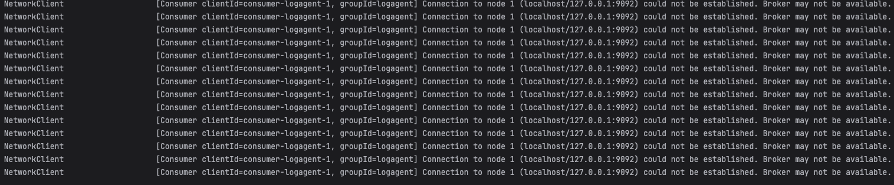
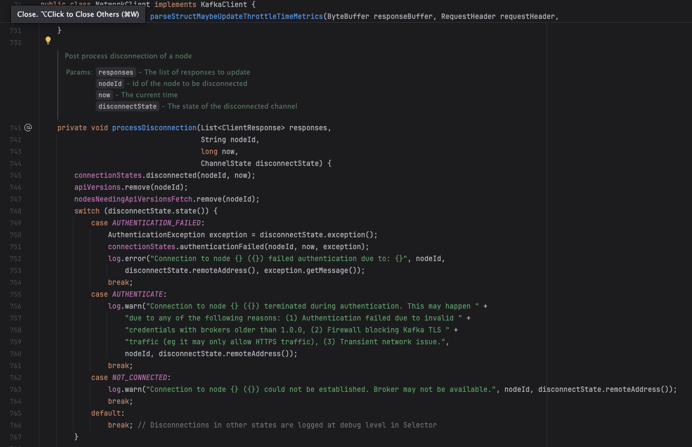
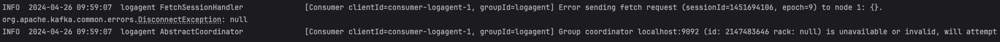

# 카프카 연결 실패 로깅 비활성화

## 문제 상황
스프링 애플리케이션에서 카프카 연결에 실패하면 아래와 같은 에러 폭탄을 맞게 된다.



물론 카프카 프로세스가 죽지 않도록, 빠른 시간 내에 복구하도록 관리하는게 베스트이겠지만 B2B 환경에서는 바로바로 대응한다는 보장이 없다.

꼭 고객사만의 얘기가 아니라 개발 서버에 올려져 있는 서버의 경우, 항상 사용하는 것이 아니므로 카프카를 관리하기 어렵다.

3시간 정도 카프카가 꺼져있었는데 수십 기가의 로그 파일이 남았고 이 상황이 오래 지속된다면 해당 서버의 디스크 용량에 문제를 일으킬 수 있었다.

## 해결

해당 로그가 찍히지 않도록 처리하는 방법을 고민했고 기존 팀이 사용중인 logback을 이용하는 방법으로 문제를 해결했다.

이 로그를 찍어내는 `org.apache.kafka.clients.NetworkClient` 클래스에서 생성하는 warn 레벨의 로그를 출력하지 않도록 logback.xml 파일에 추가했다.



```xml
<logger name="org.apache.kafka.clients.NetworkClient" level="ERROR" />
```

## 마무리 

설정 이후 카프카 연결을 끊어보면 카프카 연결이 끊겼다는 일회성 로그만 발생하고 지속적으로 발생하는 로그는 더 이상 나오지 않는다.

