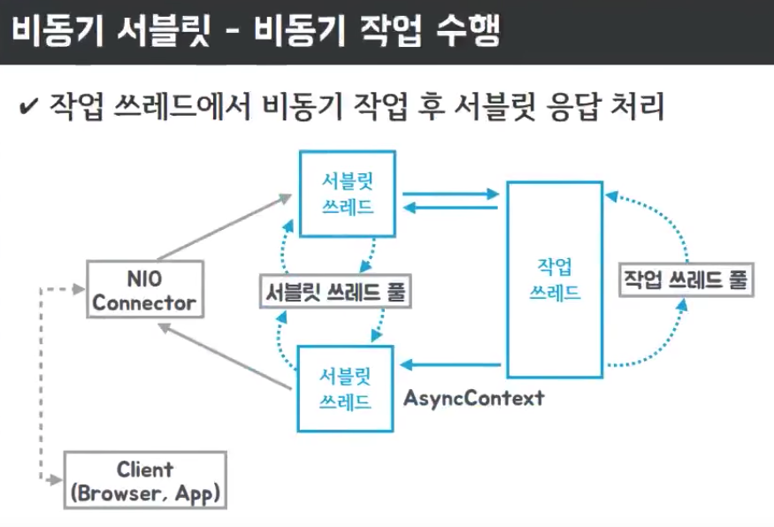

# 자바와 스프링의 비동기 기술

## 자바의 비동기 기술

### Future

`Future`는 비동기 처리의 결과를 나타내는 인터페이스이다.

`Callable` 인터페이스를 구현한 객체를 `ExecutorService`에 전송하면 `Future` 객체를 반환한다.

```java
@Slf4j
public class FutureExample {
    public static void main(String[] args) throws InterruptedException, ExecutionException {
        final ExecutorService executorService = Executors.newCachedThreadPool();

        final Future<String> future = executorService.submit(() -> {
            Thread.sleep(2000L);
            log.info("Async");
            return "Hello";
        });

        System.out.println(future.isDone());
        log.info("Exit");
        System.out.println(future.isDone());
        log.info(future.get()); // Blocking 처리 될 때까지 기다림

        executorService.shutdown();
    }
}
```

결과
```Console
false
18:53:36.598 [main] INFO com.example.springasync.future.FutureExample -- Exit
false
18:53:38.598 [pool-1-thread-1] INFO com.example.springasync.future.FutureExample -- Async
18:53:38.603 [main] INFO com.example.springasync.future.FutureExample -- Hello
```

비동기 처리 작업을 수행하고 결과를 가져오기 위해 `future.get()`을 호출하면 해당 스레드가 작업이 완료될 때까지 블로킹된다.

## 스프링의 비동기 기술

### @Async

`@Async` 어노테이션을 사용하면 비동기 처리를 할 수 있다.

```java
@Slf4j
@EnableAsync
@SpringBootApplication
public class AsyncExample {
    @Component
    public static class AsyncService {
        @Async
        public Future<String> asyncMethod() throws InterruptedException {
            log.info("Async");
            Thread.sleep(2000L);
            return new AsyncResult<>("async result");
        }
    }

    @Autowired
    private AsyncService asyncService;

    @Bean
    ApplicationRunner applicationRunner() {
        return args -> {
            log.info("run");
            final Future<String> stringFuture = asyncService.asyncMethod();
            log.info("exit {}", stringFuture.isDone());
            log.info("result {}", stringFuture.get());
        };
    }

    public static void main(String[] args) {
        try (final ConfigurableApplicationContext run = SpringApplication.run(AsyncExample.class, args)) {

        }
    }
}
```

결과
```Console
2024-05-09T19:32:02.080+09:00  INFO 24220 --- [spring-async] [main] c.e.s.spring.async.AsyncExample          : run
2024-05-09T19:32:02.083+09:00  INFO 24220 --- [spring-async] [task-1] c.e.s.spring.async.AsyncExample        : Async
2024-05-09T19:32:02.083+09:00  INFO 24220 --- [spring-async] [main] c.e.s.spring.async.AsyncExample          : exit false
2024-05-09T19:32:04.092+09:00  INFO 24220 --- [spring-async] [main] c.e.s.spring.async.AsyncExample          : result async result
```

`@EnableAsync` 어노테이션을 사용하여 비동기 처리를 활성화한다.

`@Async` 어노테이션이 붙은 메서드는 비동기로 실행되며, 반환값은 `Future`로 감싸져 반환된다.

결과를 보면 `@Async` 어노테이션이 붙은 메서드가 별도의 스레드에서 실행되는 것을 확인할 수 있다.

> Future 대신 ListenableFuture 를 사용하여 콜백을 받을 수 있다.
> 하지만 org.springframework.util.concurrent.ListenableFuture 객체는 스프링 6.0부터 Deprecated 되었으며
> 현재는 java.util.concurrent.CompletableFuture를 사용하도록 권장한다.

`@Async` 어노테이션을 사용하면 작업을 별도의 스레드에서 비동기로 실행된다.
이 때, `SimpleAsyncTaskExecutor`가 사용되는데 이는 각각의 비동기 처리마다 새로운 스레드를 생성한다.
이는 매우 비효율적이므로 `ThreadPoolTaskExecutor` 스레드 풀을 사용하는 것이 좋다.

```java
    @Bean
    ThreadPoolTaskExecutor threadPoolTaskExecutor() {
        final ThreadPoolTaskExecutor threadPoolTaskExecutor = new ThreadPoolTaskExecutor();
        threadPoolTaskExecutor.setCorePoolSize(10);
        threadPoolTaskExecutor.setMaxPoolSize(100);
        threadPoolTaskExecutor.setQueueCapacity(200);
        threadPoolTaskExecutor.setThreadNamePrefix("myThread-");
        threadPoolTaskExecutor.initialize();
        return threadPoolTaskExecutor;
    }
```

`setMaxPoolSize()`를 통해 최대 스레드 개수를 지정할 수 있으며, 요청이 `setCurrentPoolSize()`를 넘어가면 생성하는 것이 아닌 큐에 담아두고 큐 사이즈를 초과하게 되면 스레드를 생성한다.

### Async Servlet

스프링 3.2부터 서블릿 3.0의 비동기 기능을 지원한다.

톰캣의 기본 스레드 개수는 200개이다. 이는 동시 요청이 200개까지만 처리할 수 있다는 것을 의미한다.

만약 서블릿 스레드에서 블로킹 작업을 수행하는 요청이 많은 경우를 가정해보자.

이 경우, 서블릿 스레드는 블로킹 작업을 수행하는 동안 다른 요청을 처리할 수 없다.

하지만 별도의 워커 스레드에 블로킹 작업을 비동기 논블로킹으로 위임하면 서블릿 스레드는 다른 요청을 처리할 수 있다.



> 서블릿 스레드 관점에서 다른 스레드로 요청을 위임하고, 결과를 기다리지 않고 다른 요청을 처리하기 때문에 비동기라고 할 수 있다.

이것을 가능하게 하는 것이 서블릿 3.0 이상의 비동기 기능이다.

#### Spring Callable 

Spring에서 비동기 처리를 위해 `Callable`을 사용할 수 있다.

비동기 서블릿 테스트 환경과 결과를 약식으로 기술하겠다. 자세한 테스트는 영상을 참고하자.

공통적인 테스트 환경은 spring task executor의 스레드 풀을 100개로 설정하고 동시에 100개의 요청을 Callable Controller (thread sleep 2000L) 보내는 것이다.  

톰캣 서블릿 스레드의 개수와 Callable 사용 유무에 따라 결과가 달라진다.  

- 서블릿 스레드 200 + Callable -> 4.x 초  
  thread sleep 2000L인데 2.x초가 아닌 이유는 실행할 때 부가적인 시간이 포함되는 것 같다. 4000L 로 하면 6.x 초가 나온다.    
- 서블릿 스레드 20 + Callable -> 4.x 초
- 서블릿 스레드 20 + Callable 사용 안함 -> 12.x 초   
  스레드 풀이 20개이기 때문에 20개씩 순차적으로 처리되기 때문에 2초 * 5번 = 10초 + 부가적인 시간 2.x 초
- 서블릿 스레드 1 + Callable -> 4.x 초  

요청을 다 받아서 별도의 워커 스레드를 생성해서 처리하는 것이므로 크게 의미가 없다고 생각할 수 있다.

이대로 사용하면 물론 의미가 없지만, 조금 오래 걸려도 상관없는 작업이라면 별도의 큐를 만들어 저장하고 천천히 처리할 수 있는 상황에서는 의미가 있다.

#### DeferredResult


`DeferredResult`는 이름 그대로 결과를 지연시키는 방식이다.

위에 설명한 `Callable`과 비슷하지만, `Callable`은 별도의 워커 스레드를 생성하지만 `DeferredResult`는 별도의 스레드를 생성하지 않는다.

```java
@Slf4j
@EnableAsync
@SpringBootApplication
public class DeferredResultExample {

    private static final long MILLIS = 2000L;

    @RestController
    public static class DeferredResultController {
        private final Queue<DeferredResult<String>> results = new ConcurrentLinkedQueue<>();

        @GetMapping("/dr")
        public DeferredResult<String> dr() {
            log.info("dr");
            DeferredResult<String> dr = new DeferredResult<>(600000L);
            results.add(dr);
            dr.onCompletion(() -> results.remove(dr));
            return dr;
        }

        @GetMapping("/dr/count")
        public String drCount() {
            return String.valueOf(results.size());
        }

        @GetMapping("/dr/event")
        public String drEvent(String msg) {
            for (DeferredResult<String> dr : results) {
                dr.setResult("Hello " + msg);
            }
            return "OK";
        }
    }

    public static void main(String[] args) {
        SpringApplication.run(DeferredResultExample.class, args);
        log.info("MILLIS: {}", MILLIS);
    }
}

```

[Spring Callable](#spring-callable) 테스트에서 사용한 테스트 코드를 사용하여 동일하게 서블릿 스레드를 1개로 설정 후 100개의 요청을 보내고, /dr/event로 결과를 받는 테스트를 진행해보았다.


100의 요청이 동시에 들어오면 100개의 DeferredResult 객체가 생성되고, /dr/event로 결과를 보내면 100개의 결과가 동시에 전달된다.

`DeferredResult`는 이벤트성 요청을 처리하는데 사용하거나, 수신 서버가 직접 처리하기 위해선 `Callable`처럼 별도의 스레드를 생성해야 할 것이다.

넌블러킹으로 처리하는 것과 조합하면 좋은 성능을 낼 수 있다. 

가령, 미리 특정 작업을 처리하는 스레드를 만들어 놓고 요청이 들어오면 해당 스레드에 위임히고 작업이 완료되면 결과를 전달하는 방식이 있을 수 있다.

## 후기

사실 현재 재직 중인 회사에서 로그성 데이터의 저장을 `DeferredResult`를 이용하여 내부 메시지 큐에 저장하고, 별도의 스레드에서 처리하는 방식을 사용하고 있다.

이를 통해 여러 서버에서 들어오는 로그성 데이터를 최대한 요청을 수신하여 저장하여 안정성과 처리 성능을 높일 수 있었다.

내가 사용하는 기술을 제대로 이해하고 사용하고 싶어서 공부했고 비동기 기술에 대해 이해할 수 있었던 좋은 시간이었다.
